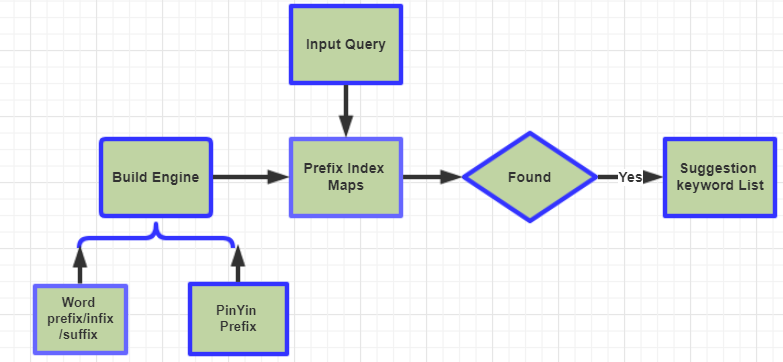

## Query Suggestion
### 1. Intoduction
This a query auto-completion system can be used in any searching scenario.I found query suggestion is an useful application in project,but there was 
no more documents or codes ,so I want to rebuild this project, andd make it more light and easy to use, and support different interface.

### 2. System Framework
Query Suggestion here was a very simple version, I had not adopt many algorithms,bellow is the system workflow.

As shown in figure, the main process of this project was the offline, we generated prefixes(contain pinyin,shengmu,chinese words) maps, at online situtation,
use the input query(maybe one word, one alphabet, not a completed query) as key to find in maps,and recall it's keywords list, last we rank the candidated 
keywords and return. The advantages of the project was **efficient and convenient**, you just only need to prepare the corpus, which may the query logs in
search engine, or titles of product or news and other corpus.But the disadvantages also obvious, real-time and incomplete coverage because you can not supply \
an enough big corpus so the suggestion words you want may not recommended.Anyway, we already use it in our E-commerce search and got a better result.
### 2. Algorithms and Model

### 3. Usage

### 5. Roadmap
- ~~1. Combine normalization module in include/segment/normalize.h and include/util/normalize.h~~
- ~~2. Add more unit test for normalization module~~
- ~~3. Design the old algorithm system framwork.~~
- 4 . Supply Python interface for old algorithm.
- 5 . Collect algorithm papers and documents.
- 6 . Choose one more effectient algorithm.

